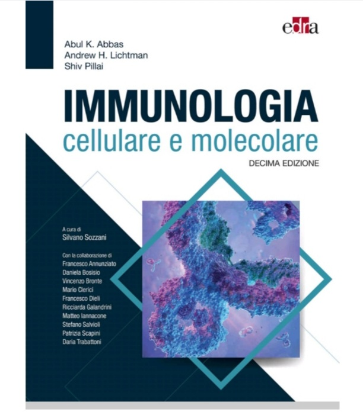
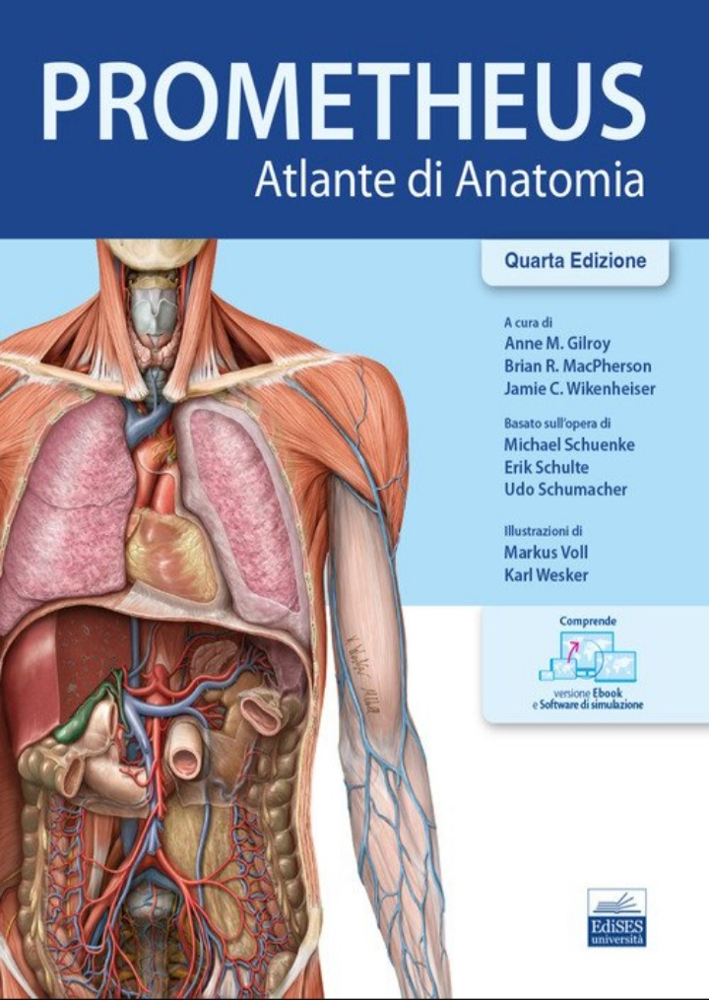

## 📚 🏥 Biblioteca Medica Digitale -Risorse Medicina e Chirurgia - Entela Boçi-UNIZKM/Tor Vergata
​

---
 
### 📚 Libro: Immunologia cellulare e molecolare - Abbas Decima Edizione (Anno 2024)
* [👉 SCARICA IL LIBRO: Abbas 10ª Edizione](https://mega.nz/file/n3ZRCIhZ#XRtfMGEQibryN8QvWxniANF_jLcEXWpF8S4RChcta8s)
* [📂 APRI L'INTERA CARTELLA (Libri e Slide)](https://mega.nz/folder/L3wUEbbL#YtG14rY53Gz2RrMLEwNlxw)

​---

​### 📊 Slide Immunologia (16 lezioni)
Ecco la cartella con il riepilogo di tutte le slide:
​[👉 APRI LA CARTELLA DELLE SLIDE QUI](https://mega.nz/folder/X3QhBIAS#suHuRMaI4O69gRFIEit84w)

---
### 📂 Materiale Extra: AIMS Medicina & Chirurgia
Qui puoi trovare 93 file di materiale di studio:
[👉 CLICCA QUI PER APRIRE I MATERIALI AIMS](https://mega.nz/folder/72In3QqT#TCgkSOs39CdkFQZEqWxc9A)

---
### 📚 Libro: Patologia Generale - Robbins e Cotran 8 Edizione
* [👉 SCARICA IL LIBRO: Robbins e Cotran](https://mega.nz/folder/275UgSTB#ulKozib5G9jfm-3lzOQFNw)
* [📂 APRI L'INTERA CARTELLA PATOLOGIA](https://mega.nz/folder/275UgSTB#ulKozib5G9jfm-3lzOQFNw)

---

## 🦴 Anatomia Umana
​

### 📚 Materiale Didattico: Testi e Atlanti
Qui puoi trovare i principali manuali e atlanti di Anatomia (Anastasi, Martini, Netter, ecc.)
[👉 APRI LA CARTELLA (MEGA)](https://mega.nz/folder/72ZmHZpB#jDWD8-FRaiUeILN2nfeJrA)

